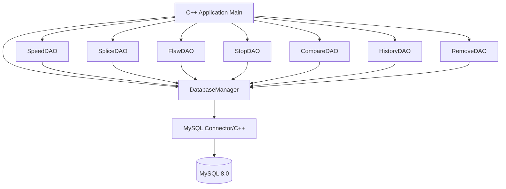
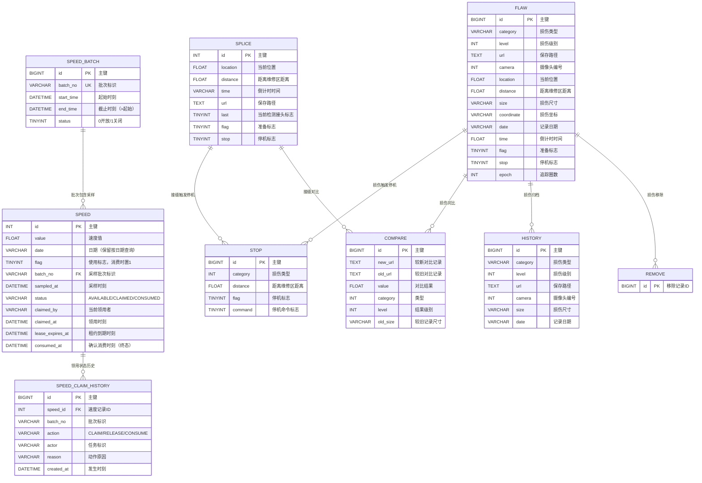

# 工业检测系统 - C++ MySQL 数据访问层

## 1. 系统架构



## 2. ER 图



## 2.1 SPEED 一次性领用 / 可追溯流程

针对“两个检测任务同时刻拿到同一条速度记录、日志只有日期无法追溯批次与领用时刻”的问题：

- **批次有效**：`SPEED_BATCH` 的 `start_time < end_time` 由 CHECK 约束强制；`claim` 仅在批次 `status=0` 且 `NOW()` 落在窗口内时发放。
- **并发不重复发放**：`claim()` 在单条事务内用 `SELECT ... FOR UPDATE SKIP LOCKED` 锁定候选行，再以 `WHERE status='AVAILABLE'` 条件更新。两个连接上的领取者同时竞争时，一个拿到记录，另一个跳到下一条或得到空结果。
- **取消/超时可重新释放**：持有者 `release()`（任务取消）或系统 `reclaimExpiredLeases()`（租约超时）把 `CLAIMED` 复位为 `AVAILABLE`，清空持有者与租约。
- **确认消费不可逆**：`consume()` 将记录置为 `CONSUMED` 终态并 `flag=1`；终态拒绝任何释放/他人确认，同任务重连后重试幂等成功。事务一旦 COMMIT，即使数据库连接重建，状态也不倒退。
- **全程可追溯**：每次 CLAIM / RELEASE / CONSUME 都向 `SPEED_CLAIM_HISTORY` 追加一行（动作、操作者、原因、时刻），运维可按记录或批次查清历次领取、释放、消费的原因。
- **向后兼容**：保留 `date`、`flag` 字段及 `findByDate()` 等原有调用方式。

### 领用状态机

```
AVAILABLE ──claim──▶ CLAIMED ──consume──▶ CONSUMED(终态)
     ▲                  │  ▲
     └──release/超时回收┘  └──仅在租约有效期内由持有者确认
```

### 事务边界

`insertWithBatch / claim / release / reclaimExpiredLeases / consume` 每个方法都是
`START TRANSACTION` → 行锁 + 状态翻转 + 历史写入 → `COMMIT`（异常 `ROLLBACK`）的完整边界，
保证状态变更与历史记录同生共死。多任务并发时各自使用独立连接（`DatabaseManager::create`）。

## 3. 模块清单

| 模块 | 文件 | 职责 |
|------|------|------|
| DatabaseManager | db/DatabaseManager.h/.cpp | 连接池管理、SQL执行 |
| Entity | entity/*.h | 各表实体类定义 |
| DAO | dao/*.h/*.cpp | 各表CRUD操作 |
| Logger | utils/Logger.h/.cpp | 日志记录 |
| Main | main.cpp | 入口与演示 |

## 4. 技术选型

- C++17
- MySQL Connector/C++ 8.0 (X DevAPI / Legacy C API)
- CMake 3.16+
- spdlog (日志，可选，本项目使用自实现轻量Logger)
