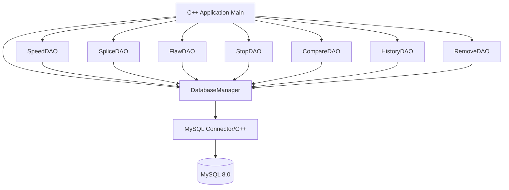
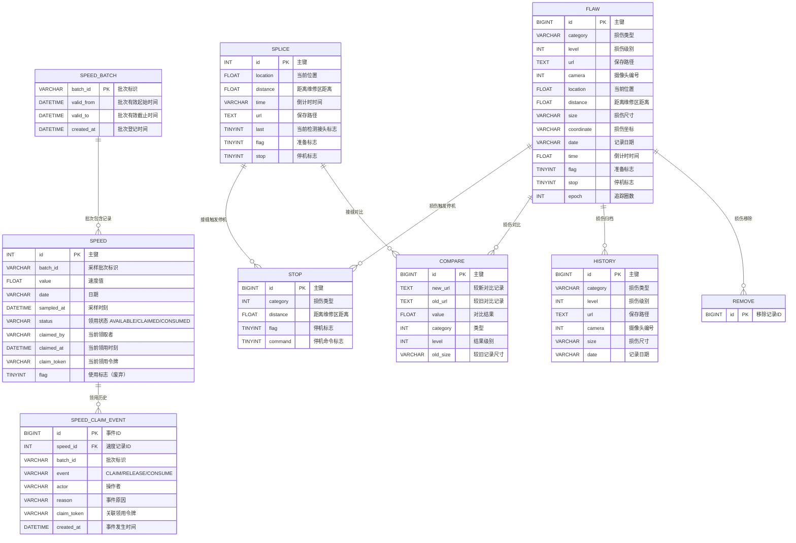

# 工业检测系统 - C++ MySQL 数据访问层

## 1. 系统架构

## 2. ER 图

## 3. 模块清单

| 模块 | 文件 | 职责 |
|------|------|------|
| DatabaseManager | db/DatabaseManager.h/.cpp | 连接管理、SQL执行、事务边界（transaction/begin/commit/rollback） |
| Entity | entity/*.h | 各表实体类定义 |
| DAO | dao/*.h/*.cpp | 各表CRUD操作；SpeedDAO 额外承担批次登记与一次性领用流程 |
| Logger | utils/Logger.h/.cpp | 日志记录 |
| Main | main.cpp | 入口与演示 |

## 5. SPEED 一次性领用流程

- 批次：`SPEED_BATCH` 登记采样批次，`CHECK(valid_to > valid_from)` 保证起止时间有效，只有窗口内的批次允许领取。
- 领取：`SpeedDAO::claimNext/claimById` 用单条原子 UPDATE 完成 `AVAILABLE -> CLAIMED`，并发竞争只有一个事务成功，不会重复发放。
- 释放：任务取消（`releaseClaim`）或超时（`releaseExpired`）后，未消费的记录回到 `AVAILABLE` 可重新领取。
- 消费：`consumeClaim` 只允许 `CLAIMED -> CONSUMED`，提交后持久化，连接重建也不会倒退。
- 审计：状态变更与 `SPEED_CLAIM_EVENT` 事件在同一事务内提交，运维可按记录或批次查询历次领取、释放、消费的原因。

## 4. 技术选型

- C++17
- MySQL Connector/C++ 8.0 (X DevAPI / Legacy C API)
- CMake 3.16+
- spdlog (日志，可选，本项目使用自实现轻量Logger)
